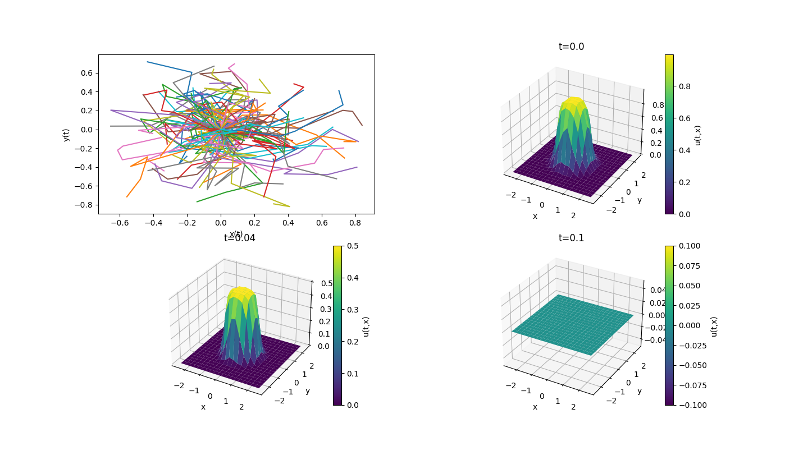
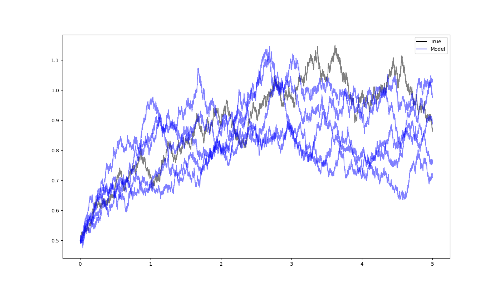

# shillml
<!-- badges: start -->
<!-- badges: end -->
This is a package for all my ML algorithms/models.


## Installation

You can install the package via from GitHub on windows/mac in command line with:

``` 
python -m pip install git+https://github.com/shill1729/shillml.git
```

## Features
The package has functions/classes for

### Feed Forward Neural Networks:
Features:
1. Feedforward Neural Network: Create customizable feedforward neural networks with specified layers and activation functions.
2. Device Management: Easily switch between CPU and GPU for computations.
3. Jacobian Computation: Compute the Jacobian matrix of the network's output with respect to its input using either autograd or explicit methods.
4. Hessian Computation: Compute the Hessian matrix for batched input data.
5. Weight Tying: Tie the weights of two networks for symmetrical architectures.
6. Support for Batched Inputs: Efficiently handle computations for batched input data.


```python
import torch
import torch.nn.functional as F
from shillml.ffnn import FeedForwardNeuralNet, get_device
# Define a network with 2 input neurons, 3 hidden neurons, and 1 output neuron
neurons = [2, 3, 1]
activations = [F.tanh, F.tanh, None]
net = FeedForwardNeuralNet(neurons, activations)
# Set device
device = get_device("cpu")
net.to(device)
# Forward pass
x = torch.tensor([[1.0, 2.0]], requires_grad=True).to(device)
output = net(x)
print("Output:", output)
# Jacobian of network
jacobian = net.jacobian_network(x, method="autograd")
print("Jacobian:", jacobian)
```

### Symbolic computations:
- Infinitesimal generators
- Adjoint generators
- SDE coefficients for Riemannian Brownian motion in local coordinates
- SDE coefficients for Riemannian Brownian motion in embedded in $\mathbb{R}^D$

### SDE solvers:
- Euler-Maruyama
- Milstein (TODO)
- Runge-Kutta (TODO)

### Parabolic PDE Solvers:
- Monte-Carlo parabolic PDE solvers (via Feynman-Kac formula)
- Implicit finite difference solvers for parabolic PDEs

### Hyperbolic PDE solvers:
- Implicit finite difference solver for the telegrapher type
- Monte-Carlo solvers for the telegrapher PDE

### Neural SDEs via MLE of stochastic integration schemes
- The Euler-Maruyama scheme gives a discrete-time Gaussian-Markov process approximation to the SDE
- We can parameterize the SDE coefficients as neural networks and then maximize this approximate likelihood
- Milstein-scheme leads to another discrete-time Markov process but is no longer simply Gaussian (TODO)


## Symbolic computation of local SDE coefficients of Riemannian Brownian motion
The user can supply coordinates $x,y$ a chart,
$$\phi(x,y) = (x_1(x,y), x_2(x,y), x_3(x,y))^T,$$
and the app will compute the metric tensor $g = D\phi^T D\phi$ and the coefficients for 
an SDE defining Brownian motion locally up to the first exit time of the chart:
$$dZ_t = \frac12 \nabla_g \cdot g^{-1}(Z_t) dt + \sqrt{g^{-1}(Z_t)}dB_t,$$
where $g^{-1}$ is the inverse metric tensor, the diffusion coefficient is its unique square root,
and $\nabla_g \cdot A$ is the manifold-divergence applied row-wise to the matrix $A$. The manifold
divergence of a vector field $f$ is $\nabla_g \cdot f = (1/\sqrt{\det g}) \nabla \cdot (\sqrt{\det g} f)$
where $\nabla \cdot h$ is the ordinary Euclidean divergence of the vector field $h$.
```python
import  matplotlib.pyplot as plt
from shillml.sde_cas import *
from shillml.solvers import euler_maruyama

# sympy input
t, x, y = sp.symbols("t x y", real=True)
xi = sp.Matrix([x, y])
coord = sp.Matrix([x, y])
g = metric_tensor(xi, coord)

# Path input
x0 = np.array([1.5, 3.14])
tn = 1
seed = 17
n = 9000

mu, sigma = local_bm_coefficients(g, coord)
f = sp.Function("f")(*coord)
inf_gen = infinitesimal_generator(f, coord, mu, sigma)
adj_gen = adjoint_generator(f, coord, mu, sigma)
print("Metric tensor")
print(g)
print("Local drift")
print(mu)
print("Local diffusion")
print(sigma)
print("Infinitesimal generator")
print(inf_gen)
print("Fokker Planck RHS")
print(adj_gen)

# Do any substitutions here
mu_np, sigma_np = sympy_to_numpy_coefficients(mu, sigma, coord)
xt = euler_maruyama(x0, tn, mu_np, sigma_np, n, seed=seed)

fig = plt.figure()
ax = plt.subplot(111)
ax.plot3D(xt[:, 0], xt[:, 1], color="black")
plt.show()
```

## Symbolic computation of SDE coefficients of RBM embedded in Euclidean space

Many every day surfaces can be written as the zeros of some smooth function:
1. Sphere: $f(x,y,z)=x^2+y^2+z^2-1$
2. Ellipsoid $f(x,y,z)=(x/a)^2+(y/b)^2+(z/c)^2-1$
3. Paraboloid: $f(x,y,z)=(x/a)^2+(y/b)^2-z$
4. Hyperbolic Paraboloid: $f(x,y,z)=(y/b)^2-(x/a)^2-z$
5. Hyperboloid $f(x,y,z)=(x/a)^2+(y/b)^2-(z/c)^2-1$
6. Cylinder $f(x,y,z)=x^2+y^2-1$
7. Torus $f(x,y,z)=(\sqrt{x^2+y^2}-R)^2+z^2-r^2$

The orthogonal projection method to generate Brownian motion is as follows. Given a surface $M$ that can be written as
$$M = f^{-1}(\{0\})$$
for some smooth $f:\mathbb{R}^3\to \mathbb{R}$, we can define the normal vector
$$n(x)=\frac{\nabla f(x)}{\|\nabla f(x)\|},$$
and then the orthogonal projection to the tangent subspace at $x$ on $\Sigma$,
$$P(x)=I-n(x)n(x)^T,$$
where matrix multiplication is being used.

Then the Stratonovich SDE for BM on $\Sigma$ is
$$\partial X_t = P(X_t)\partial B_t$$
and the Ito SDE is
$$d X_t = c(X_t)n(X_t) dt + P(X_t) dB_t,$$
where $c=-\frac 12 \nabla \cdot n$ is the mean curvature of the surface in the direction of
the normal (chosen to face "inward").

More generally, for intersections of hypersurfaces we have
$$dX = N^T(c+q)dt + P(X)dB,$$
where the rows of $N$ are the $K=D-d$ normal vectors, $c$ is a vector of size $K$ whose
components are the mean curvatures in the direction of the normals, and $q$ is some
nasty term: $q^r = \mathop{\text{Tr}}(N D[n_r] N^T)$.


## Feynman-Kac formula
The function $u\in C^{1,2}([0, T]\times \mathbb{R}^n, \mathbb{R})$ solves
$$\frac{\partial u}{\partial t} + \mu(x)^T \nabla_x u(t, x)+ \frac12 \mathop{\text{Tr}}(\Sigma(x) \nabla_x^2 u(t,x))=0$$
with terminal condition $u(T, x) = h(x)$, if and only if
$$u(t,x) = \mathbb{E}(h(X_T) | X_t=x).$$
This can be extended to include "running-costs". Indeed, $u\in C^{1,2}([0, T]\times \mathbb{R}^d, \mathbb{R})$ solves
$$\frac{\partial u}{\partial t} + \mu(t, x)^T \nabla_x u(t,x)+\frac12 \mathop{\text{Tr}}(\Sigma(t,x) 
\nabla_x^2 u(t,x))+f(t,x)=0$$
with terminal condition $u(T,x)=h(x)$, if and only if
$$u(t,x) = \mathbb{E}\left[\int_t^T f(s, X_s)ds +h(X_T) | X_t=x\right]$$
where $\nabla_x$ is the gradient of a scalar function with repsect to $x$ and $\nabla_x^2$ is the Hessian 
of a scalar with respect to $x$. Here, $(X_t)_{t\geq 0}$ solves the SDE
$$dX_t = \mu(t, X_t) dt+\sigma(t, X_t)dB_t$$
where $B$ is a standard Brownian motion in $\mathbb{R}^m$, $\mu:[0,T]\times \mathbb{R}^d\to \mathbb{R}^d$ and 
$\sigma: [0, T]\times 
\mathbb{R}^d\to \mathbb{R}^{d\times m}$ and finally $\Sigma(t,x)= \sigma(t,x)\sigma(t,x)^T$ is the infinitesimal 
covariance.

For solutions to the SDE to exist, we only require locally Lipschitz continuity of $\mu$ and $\sigma$ in $x$. Here, 
the terminal cost $h$ and the running cost are allowed to be non-smooth. This is a highly efficient solver in large 
dimension $d\gg 1$ and small time-scales $0< T \ll 1$ because of its very nature--the solution at a single point 
$(t,x)$ is grid-free, and we can use a small amount of time-steps in the SDE solver when $[0,T]$ is 
small without losing accuracy.

### Example:
The below example computes the proportion of time that planar Brownian motion
spends in the unit-disk, i.e. we compute
$$u(t,x)=\mathbb{E}\left[\frac{1}{T}\int_t^T \mathbb{1}_{\|X_u\| \leq 1} du|X_t=x \right].$$

In terms of the above notation, the terminal cost is $h(x)=0$, and the running cost 
is $f(t, x)=\mathbb{1}_{ \|x\| \leq 1}/T$. 

```python
# A template for 2d Fenyman-Kac problems (solving PDEs with MC estimates of SDEs)
from shillml.sdes import SDE
import numpy as np
tn = 0.1
ntime = 5
npaths = 50
noise_dim = None
x0 = np.array([1., 1.])
a = -1.5
b = 1.5
c = -1.5
d = 1.5
space_grid_size = 20
time_grid_size = 5
grid_bds = [a, b, c, d]
grid_sizes = [space_grid_size, time_grid_size]


def mu(t, x):
    return np.zeros(2)


def sigma(t, x):
    return np.eye(2)


def f(t, x):
    # return np.abs(x) < 1.
    return (np.linalg.norm(x, axis=1) < 1.)/tn


def h(x):
    return 0.


# For 2-d PDE estimation
sde = SDE(mu, sigma)
sde.feynman_kac_2d(f, h, x0, tn, grid_bds, grid_sizes, ntime, npaths, noise_dim)
```



## Neural SDEs via MLE of stochastic integration schemes

### Euler-Maruyama/Neural Gaussian Markov with approximations to SDEs
Every stochastic integration scheme yields a discrete-time, finite-order, Markov process approximation to the original
SDE. The conditional distribution of this approximate process will have parameters in terms of the original SDE
coefficient functions. If we replace these with neural networks, then we can approximate the original one by maximizing
the (log)-likelihood of this approximate process over the neural-network parameters (weights and biases).

For example, the Euler-Maruyama scheme for our SDE says that
$$X_{i+1} = X_i +\mu_i h + \sigma_i \sqrt{h}Z_i,$$
where $\mu_i = \mu(t_i, X_i)$, and $\sigma_i = \sigma(t_i, X_i)$ and where we write $X_i=X_{t_i}$ for notational 
convenience. This says that conditional on $X_i=x_i$, $X_{i+1}$ is distributed like 
$$\mathcal{N}(x_i+\mu_i h, \Sigma_i h),$$
where $\Sigma_i = \sigma_i \sigma_i^T$.

Recall that for any Markov process $(X_n)_ {n \geq 0}$ we have
$$f(x_0, \dotsc, x_n) = f(x_0)\prod_{i=0}^n f(x_{i+1}| x_i).$$
Hence, in particular, this applies to our discretized sample-path $(X_{t_i})_ {i=0}^n$ obtained from the EM-scheme, 
since it is obviously a discrete-time Markov process in its own right. If we have $j=1,2,\dotsc, N$ independent sample 
paths all starting from $X_0=x_0$, then the joint density of these $N$ paths is given by
$$f\left((x_ i^1)_ {i=0}^n, \dotsc, (x_ i^N)_ {i=0}^n \right) = \prod_ {j=1}^N f(x_ 0^j, \dotsc, x_ n^j)$$
$$= f(x_0)^N \prod_ {j=1}^N \prod_ {i=0}^n f(x_ {i+1}^j| x_ i^j).$$
Now simply plug in the conditional Gaussian density we specified earlier for $f(x_{i+1}|x_i)$ and take logarithms. This 
gives the log-likelihood of the discretized ensemble $X\in \mathbb{R}^{N \times (n+1) \times d}$ ($N$ paths, $n$ time 
steps, $d$ dimensions),
$$l(X;\theta) = N \log f(x_0) -\frac{n}{2} \log \pi -\frac12 \sum_{j=1}^N \sum_{i=0}^n Q(i,j;\theta)+
\log \det \Sigma(i,j;\theta_2)$$
where $Q(i,j,\theta)$ is the quadratic form
$$Q(i,j;\theta) := z(i,j;\theta_1)^T \Sigma^{-1}(i,j;\theta_2)z(i,j;\theta_1),$$
where $z(i,j;\theta_1) = x_{i+1}^j - x_i^j -\mu(x_i^j; \theta_1) h$ is the centered vector and 
$\Sigma(i,j,\theta_2) = \Sigma(x_i^j;\theta_2)h$ and $\theta = (\theta_1, \theta_2)$. To be sure, the subscripts 
$i$ refer to the time-step and the superscripts $j$ refer to the $j$-th sample path from the ensemble.

Thus we can minimize the negative log-likelihood as our loss function and this will give an MLE for our neural SDE 
model given an ensemble data-set with equal time-steps. The first two terms do not depend on the network parameters 
$\theta$, thus we may discard them in the optimization. Therefore, our loss function is
$$\mathcal{L}_ {NLL}(\theta):=-l(X;\theta) = \frac12\sum_ {j=1}^N \sum_ {i=0}^n Q(i,j;\theta)+
\log \det \Sigma(i,j;\theta_2).$$


### Example for one dimensional CIR process
We simulate a true CIR process over $T=5$ for 10,000 time steps and train on the first 5,000 for 10,000 training epochs
using 2-layer neural networks of 2 neurons each for the drift and covariance. This example code can easily be modified
for two dimensional processes. Weight decay in the training was used, with a factor of $0.01$. 
```python
# An example of our Neural SDE being fit to planar motions.
import matplotlib.pyplot as plt
import numpy as np
import torch
from shillml.sdes import SDE
from shillml.neuralsdes import NeuralSDE

x00 = [0.5]
x0 = torch.tensor(x00, dtype=torch.float32)
x0np = np.array(x00)
tn = 5.
ntime = 10000
ntrain = 5000
npaths = 1  # number of sample paths in data ensemble
npaths_fit = 5  # number of sample paths to generated under fitted model
seed = 17
lr = 0.001
weight_decay = 0.01  # Weight decay improves [32, 16] hidden dim fit by a lot!
epochs = 10000
hidden_dim = [2, 2]
num_layers = 2
noise_dim = 1
act = "Tanh"
printfreq = 1000
state_dim = x0.size()[0]
h = tn / ntime
torch.manual_seed(seed)

# Ground truth coefficients: One dimensional example: Mean-Reverting Process
def mu(t, x):
    return 1.1 * (0.9 - x)


def sigma(t, x):
    return 0.15 * np.sqrt(x)


# Generating ensemble data
sde = SDE(mu, sigma)
ensemble = sde.sample_ensemble(x0np, tn, ntime, npaths, noise_dim=noise_dim)
ensemble = torch.tensor(ensemble, dtype=torch.float32)
training_ensemble = torch.zeros((npaths, ntrain, state_dim))
test_ensemble = torch.zeros((npaths, ntime - ntrain + 1, state_dim))
for j in range(npaths):
    training_ensemble[j, :, :] = ensemble[j, :ntrain, :]
    test_ensemble[j, :, :] = ensemble[j, ntrain:, :]

# Neural SDE model to fit to ensemble data
nsde = NeuralSDE(state_dim, hidden_dim, num_layers, act, noise_dim)
nsde.fit(training_ensemble, lr, epochs, printfreq, h, weight_decay)
print("NLL on Test Ensemble = " + str(nsde.loss(test_ensemble, h)))

# Throw to an SDE object for convenient simulations of ensembles
sde_fit = SDE(nsde.mu_fit, nsde.sigma_fit)
ensemble_fit = sde_fit.sample_ensemble(x0np, tn, ntime, npaths=npaths_fit)
ensemble = ensemble.detach().numpy()

# Plot ensembles
fig = plt.figure()
t = np.linspace(0, tn, ntime + 1)

for i in range(npaths):
    if state_dim == 2:
        plt.plot(ensemble[i, :, 0], ensemble[i, :, 1], c="black", alpha=0.5)
    elif state_dim == 1:
        plt.plot(t, ensemble[i, :, 0], c="black", alpha=0.5)
for i in range(npaths_fit):
    if state_dim == 2:
        plt.plot(ensemble_fit[i, :, 0], ensemble_fit[i, :, 1], c="blue", alpha=0.5)
    elif state_dim == 1:
        plt.plot(t, ensemble_fit[i, :, 0], c="blue", alpha=0.5)

# Creating custom legend entries
true_line = plt.Line2D([], [], color='black', label='True')
model_line = plt.Line2D([], [], color='blue', label='Model')
# Adding the legend to the plot
plt.legend(handles=[true_line, model_line])
plt.show()
```


